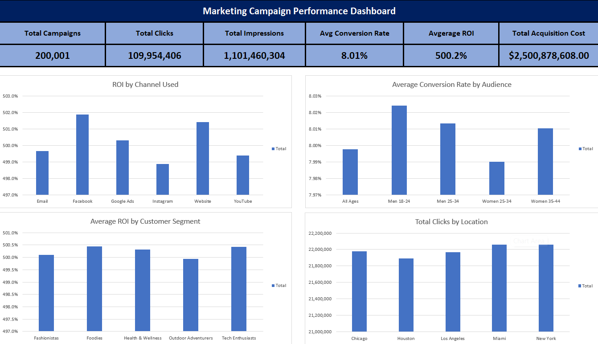
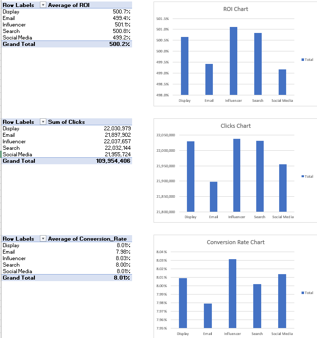
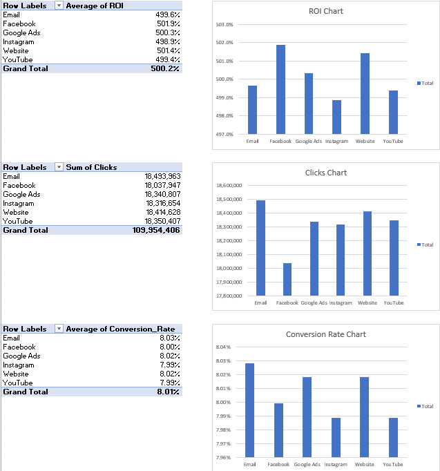
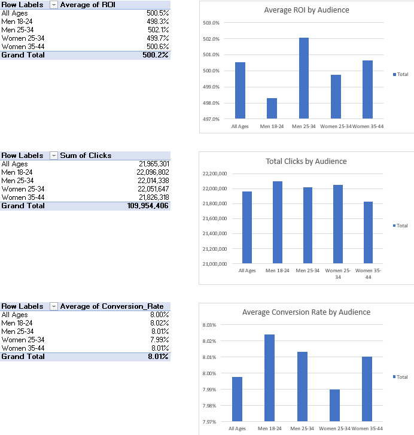
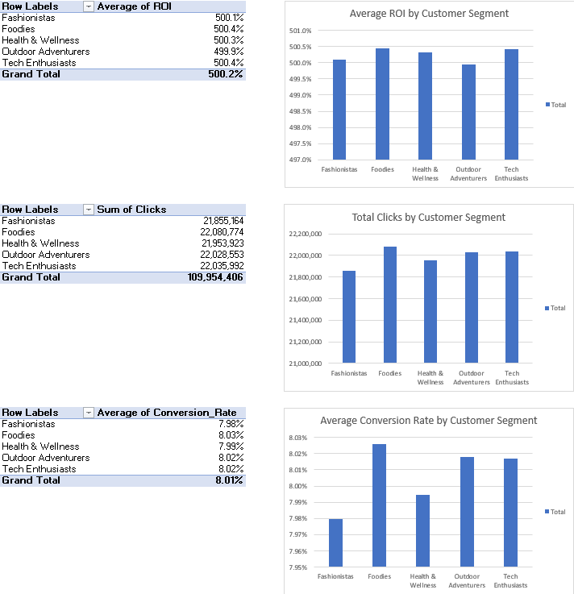
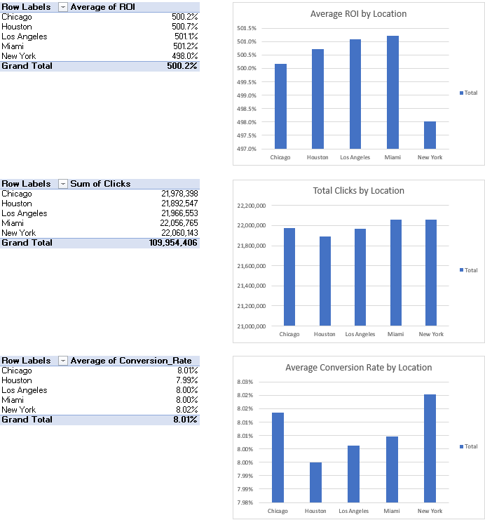
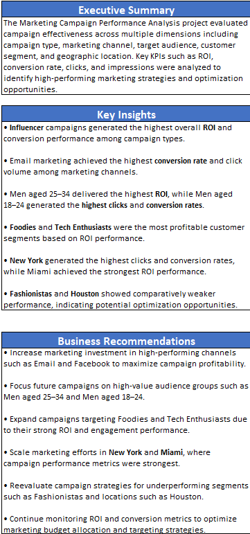

# Marketing Campaign Performance Analysis

## Project Overview

This project analyzes marketing campaign performance across multiple business dimensions including campaign type, marketing channel, audience groups, customer segments, and geographic locations. The objective of this analysis is to identify high-performing marketing strategies, optimize campaign effectiveness, and provide data-driven business recommendations.

The project includes data cleaning, KPI analysis, pivot table analysis, dashboard creation, and business insight generation using Excel.

---

## Business Problem

Marketing teams invest heavily across different channels and campaigns, but not all campaigns generate equal performance. This project aims to answer key business questions such as:

* Which marketing channels generate the highest ROI?
* Which audience groups convert best?
* Which customer segments are most profitable?
* Which locations perform strongest?
* Which campaigns should receive more marketing investment?

---

## Tools Used

* Microsoft Excel
* Pivot Tables
* Pivot Charts
* KPI Dashboarding
* Data Cleaning & Formatting

---

## Key KPIs Analyzed

* Total Campaigns
* Total Clicks
* Total Impressions
* Conversion Rate
* Return on Investment (ROI)
* Acquisition Cost

---

## Project Workflow

1. Data Cleaning and Preparation
2. KPI Calculation
3. Campaign Type Analysis
4. Channel Performance Analysis
5. Audience Analysis
6. Customer Segment Analysis
7. Geographic Performance Analysis
8. Dashboard Creation
9. Business Insights & Recommendations

---

## Dashboard Preview

### Main Dashboard



---

## Analysis Screenshots

### Campaign Type Analysis



### Channel Analysis



### Audience Analysis



### Customer Segment Analysis



### Location Analysis



### Insights & Recommendations



---

## Key Insights

* Influencer campaigns generated the strongest ROI and conversion performance.
* Email marketing delivered the highest conversion rate and click volume.
* Men aged 25–34 generated the highest ROI among audience groups.
* Foodies and Tech Enthusiasts were the most profitable customer segments.
* New York achieved the highest clicks and conversion rates.
* Miami delivered the highest ROI among all locations.

---

## Business Recommendations

* Increase investment in high-performing channels such as Email and Facebook.
* Focus future campaigns on high-value audience groups.
* Expand campaigns targeting Foodies and Tech Enthusiasts.
* Scale marketing efforts in New York and Miami.
* Reevaluate strategy for underperforming segments and locations.

---

## Project Structure

```text
Marketing-Campaign-Performance-Analysis/
│
├── data/
│   └── raw/
│
├── dashboard/
│
├── images/
│
├── reports/
│
└── README.md
```

---

## Future Improvements

* Build interactive Power BI dashboard
* Perform SQL-based campaign analysis
* Add predictive marketing analytics using Python
* Implement customer lifetime value analysis

---

## Author

Shailesh Pattankude
